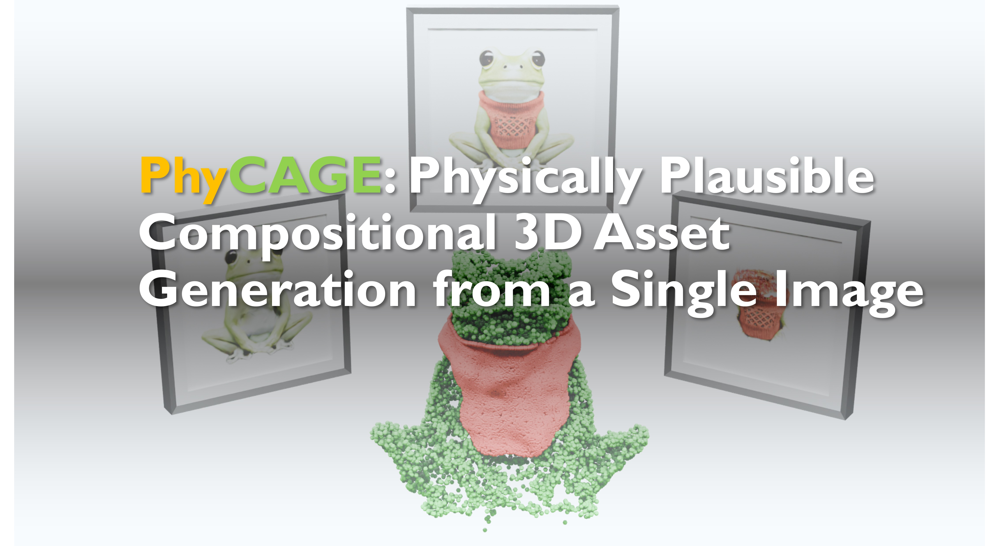

# PhyCAGE: Physically Plausible Compositional 3D Asset Generation from a Single Image


### [Project page](https://wolfball.github.io/phycage/) | [arXiv](https://arxiv.org/abs/2411.18548) | [Video](https://youtu.be/IHQqLli_s2o)




### News

- [2024.11] Arxiv released.


### Installation

```bash
conda create -n phycage python=3.9 -y
conda activate phycage
pip install torch==2.1.0 torchvision==0.16.0 torchaudio==2.1.0 --index-url https://download.pytorch.org/whl/cu118

pip install -r requirements.txt

git clone https://github.com/openai/CLIP.git
git clone --recursive https://github.com/nvlabs/tiny-cuda-nn
git clone --recursive https://github.com/ashawkey/diff-gaussian-rasterization # (modified 3dgs)
git clone https://gitlab.inria.fr/bkerbl/simple-knn.git


pip install CLIP/
pip install tiny-cuda-nn/bindings/torch/
pip install diff-gaussian-rasterization/
pip install simple-knn/


## gdsam
cd single2multi/gdsam
python -m pip install -e segment_anything
pip install --no-build-isolation -e GroundingDINO
cd ../..

cd imgs23D/imgs2neus/raymarching
python setup.py build_ext --inplace
cd ../../..


## imgs2gs
# (optional) download pytorch3d-0.7.8-py39_cu118_pyt210.tar.bz2 from https://anaconda.org/pytorch3d/pytorch3d/files
# (optional) conda install --use-local pytorch3d-0.7.8-py39_cu118_pyt210.tar.bz2

```

### Data Preparation

Put an image under testdata/, e.g., testdata/frog.png

<details><summary>Other options to get images</summary>

Put 3D model rabbit.glb into data_preparation/glbs/

```bash
# refer to https://github.com/liuyuan-pal/SyncDreamer
cd data_preparation
/Applications/Blender.app/Contents/MacOS/Blender -b --python blender_script.py -- --object_path glbs/rabbit.glb --output_dir ./mvimgs --camera_type fixed
```

Then choose one image in data_preparation/mvimgs/*.png as testdata/rabbit.png

</details>

<br>

Download pre-trained model to single2multi/ckpt/:
- [groundingdino_swint_ogc.pth](https://github.com/IDEA-Research/GroundingDINO/releases/download/v0.1.0-alpha/groundingdino_swint_ogc.pth)
- [sam_hq_vit_h.pth](https://drive.google.com/file/d/1qobFYrI4eyIANfBSmYcGuWRaSIXfMOQ8/view)
- [syncdreamer-pretrain.ckpt](https://connecthkuhk-my.sharepoint.com/personal/yuanly_connect_hku_hk/_layouts/15/onedrive.aspx?id=%2Fpersonal%2Fyuanly%5Fconnect%5Fhku%5Fhk%2FDocuments%2FSyncDreamer&ga=1)
- [ViT-L-14.pt](https://connecthkuhk-my.sharepoint.com/personal/yuanly_connect_hku_hk/_layouts/15/onedrive.aspx?id=%2Fpersonal%2Fyuanly%5Fconnect%5Fhku%5Fhk%2FDocuments%2FSyncDreamer&ga=1)

### Run

Stage 1: Multi-view Generation

```bash
cd single2multi/mvgen
python generate.py --oname frog --elevation 30 --mvgtype 0 --keep_gt

# choose an image in single2multi/output/mvimgs/frog/*.png
# if choose 0.png
cd ../gdsam
python grounded_sam_demo_one.py --oname frog --text_prompt "a frog. a red cloth." --gsatype 0

# check single2multi/output/mvimgs/frog/fusemask.png
# if it is good, then run
cd ..
python sd_inpainting.py -n frog -t "a frog" -m 0

# check single2multi/output/mvimgs/frog/inpaint/sss_*.png
# if choose sss_8.0.png
cd mvgen
python generate.py --oname frog --elevation 30 --mvgtype 1 --inpaint 8.0 --keep_gt

# check single2multi/output/mvimgs/frog/inpaint/*.png,
# if choose 0.png
cd ../gdsam
python grounded_sam_demo_one.py --oname frog --text_prompt "a frog." --gsatype 1
```


Stage 2: Multi-view Images to 3D

```bash
cd ../../imgs23D/imgs2neus
python train_part123.py -n frog
python test_part123.py -n frog -r

cd ../mesh2gs
python train_part123_3dgs.py -n frog

cd ../imgs2gs
python train_part123_sds.py -n frog
```

Stage 3: Physical Simulation-Enhanced Optimization

```bash
cd ../../phydeform/physds
python train_part123_sds.py -n frog -t "a frog"
```

### Citation
If you find our code or paper helps, please consider citing:

```text
@misc{yan2024phycage,
    title={PhyCAGE: Physically Plausible Compositional 3D Asset Generation from a Single Image}, 
    author={Han Yan and Mingrui Zhang and Yang Li and Chao Ma and Pan Ji},
    year={2024},
    eprint={2411.18548},
    archivePrefix={arXiv},
    primaryClass={cs.CV},
    url={https://arxiv.org/abs/2411.18548}, 
}
    
```


### Acknowledgments

Some source codes are borrowed from [SyncDreamer](https://github.com/liuyuan-pal/SyncDreamer), [Grounded-SAM](https://github.com/IDEA-Research/Grounded-Segment-Anything), [DreamGaussian](https://github.com/dreamgaussian/dreamgaussian), [Feature Splatting](https://github.com/vuer-ai/feature-splatting-inria).